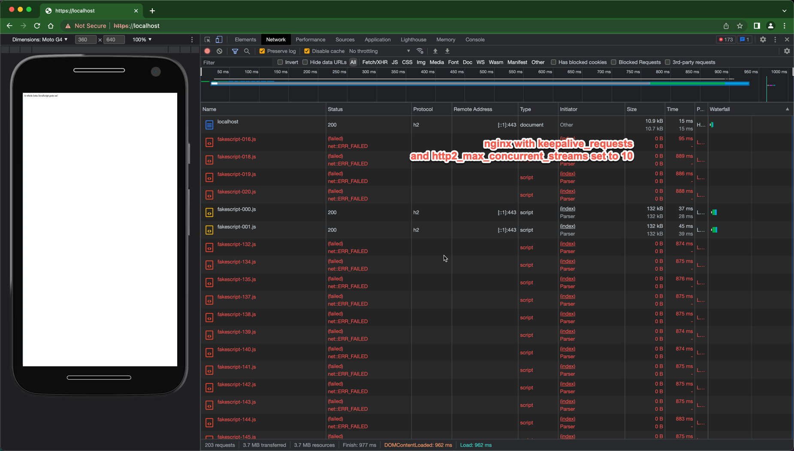

# Overview

This demonstrates how browsers (Chrome in particular) handle an HTTP2 GOAWAY frame.

It has been observed that a server sending a GOAWAY while Chrome is loading the page resources will result in the following:
1. Chrome does not appear to retry the requests that are known to not have been received / handled by the server
2. Chrome appears to discard fully received responses for streams that sent an ACK that ends up receiving an RST after the socket is closed - This does not appear to be correct as the response was correctly received and should not be discarded

There are two ways to test using this repo:

- Local Build
  - With the local build you can see Chrome sending many more than 10 requests that the server is notifying as the max concurrent streams in the SETTINGS frame (this may or may not be ok)
  - Chrome does not retry the refused streams, which it appears that it should, as it can confirm from the GOAWAY frame that the server has not received the request
- Deployed Build with AWS NLB
  - An AWS NLB will send a RST to the client if a packet is received after the socket is closed
  - This RST appears to trigger the discarding of completely received responses that get a RST in response to one of the ACKs for the packets that made up that response 

# Decrypting and Observing the HTTP2 Traffic

Use Wireshark with a pre-master secret to decrypt and decode the HTTP2 traffic.

[Instructions for pre-master secret with Wireshark](https://wiki.wireshark.org/TLS#using-the-pre-master-secret)

On Mac, Chrome is typically started with `open -a "Google Chrome"` after exporting the env var `export SSLKEYLOGFILE=/path/to/sslkeylogfile.txt`

# Local Build

## Build and Run
```
docker-compose build
docker-compose up
```

## Connect with Chrome

https://localhost/

## Observe Chrome Requests

Type `thisisunsafe` in the Chrome window to allow usage of the self-signed certificate for localhost

### With Limit 10 Requests before GOAWAY and 10 Max Concurrent Streams
```

keepalive_requests 10;
http2_max_concurrent_streams 10;
```


Initial requests are `ERR_FAILED`:



Later requests are `ERR_HTTP2_SERVER_REFUSED_STREAM`:


### With Limit 10 Requests before GOAWAY and 10,000 Max Concurrent Streams

```
keepalive_requests 10;
http2_max_concurrent_streams 10000;
```

Responses / errors are exactly the same as the 10 / 10 case above

### With Limit 10,000 requests before GOAWAY and 10,000 Max Concurrent Streams

```
keepalive_requests 10000;
http2_max_concurrent_streams 10000;
```

No errors at all:


### With Limit 10,000 requests before GOAWAY and 10 Max Concurrent Streams

```
keepalive_requests 10000;
http2_max_concurrent_streams 10;
```

https://user-images.githubusercontent.com/5617868/205175991-a6d87008-9847-4ae1-b9fd-440de0996d23.mp4

Responses / no errors - same as the 10,000 / 10,000 case above

### With Limit 195 requests before GOAWAY and 10 Max Concurrent Streams

```
keepalive_requests 190;
http2_max_concurrent_streams 10;
```
A single file *usually* fails to load with `ERR_FAILED` in this case:


### With Defaults

- [keepalive_requests docs](https://nginx.org/en/docs/http/ngx_http_core_module.html#keepalive_requests)
  - default: 1,000 
- [http2_max_concurrent_requests docs](https://nginx.org/en/docs/http/ngx_http_v2_module.html#http2_max_concurrent_streams)
  - default: 128

It took 43 page loads before 1 request failed with `ERR_FAILED`.
